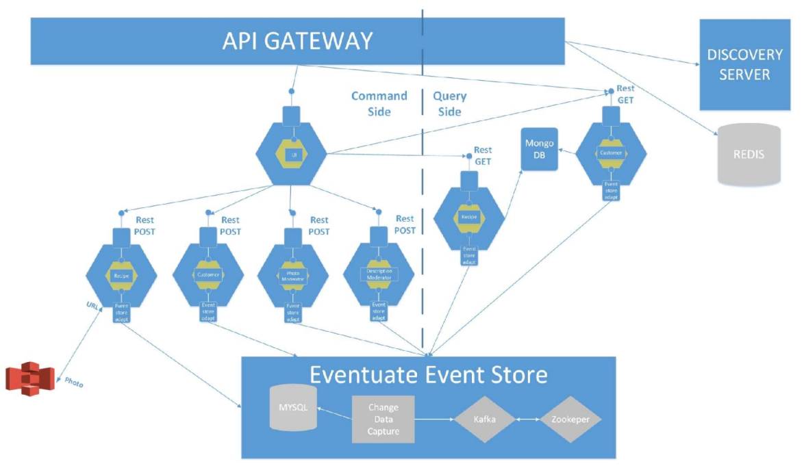

# thesis
This is an R&D proof of concept of a distributed application based on microservices architecture.
Patterns used: API Gateway, Service Discovery, Container per service, CQRS, Event Sourcing, Access Token.
Application developed using the Eventuate platform in order to solve the distributed data management problems that impose
"eventual consistency". The query-side maintains a denormalized view (thanks to the NOSQL DB Mongo).
The session management is realized using an in memory data structure store (Redis). Other relevant technologies: NETFLIX OSS,
Java 8, Docker and the related tools, Git, Spring Boot, Java Rx. Deployment of the application on a cloud based infrastructure.

